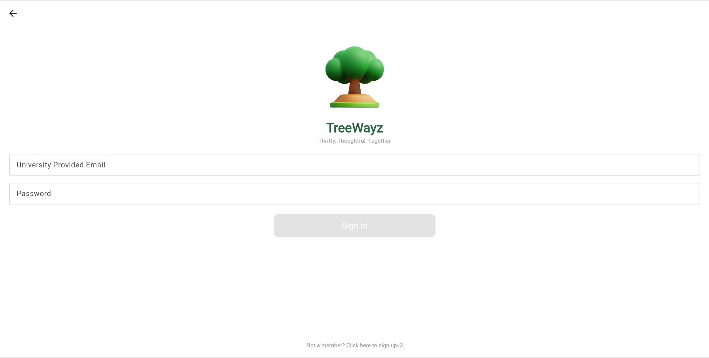
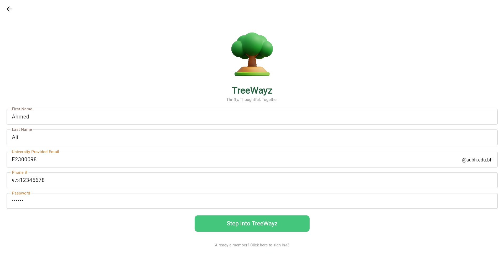
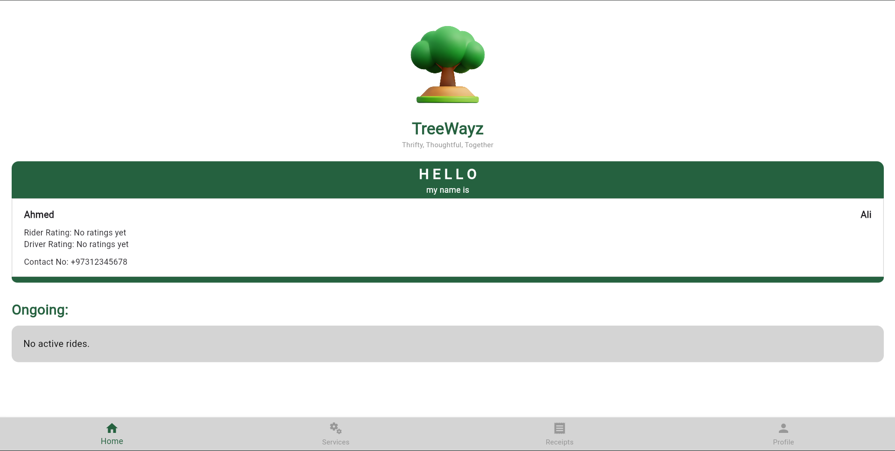
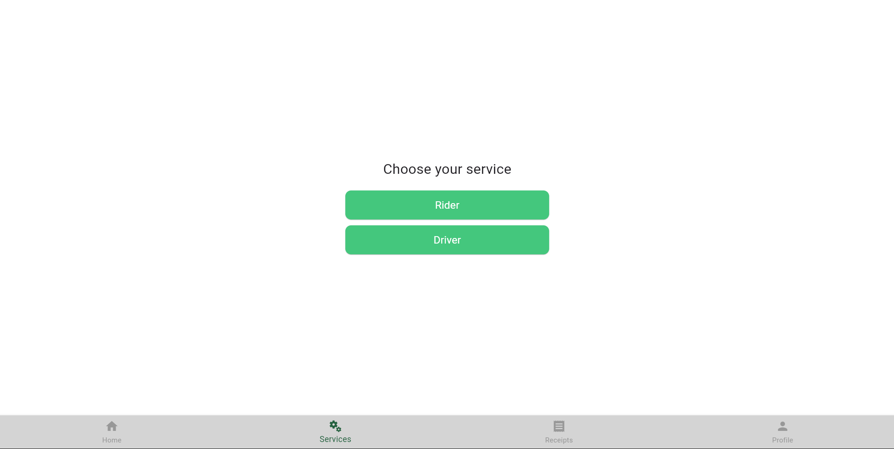
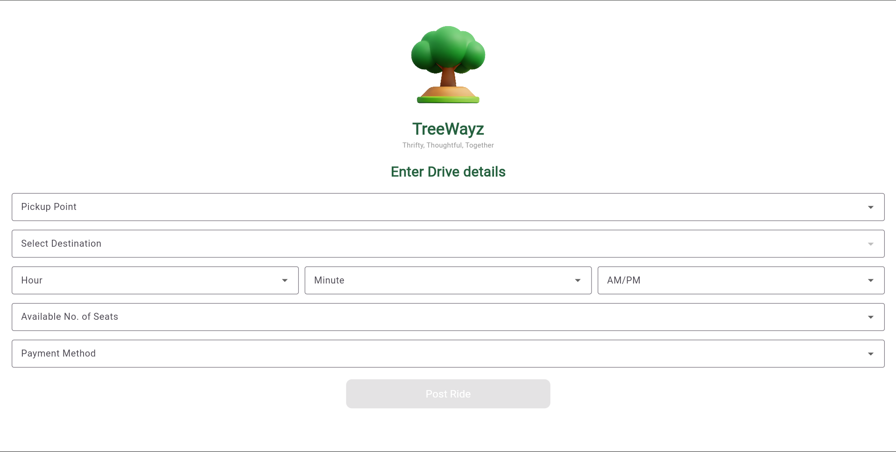
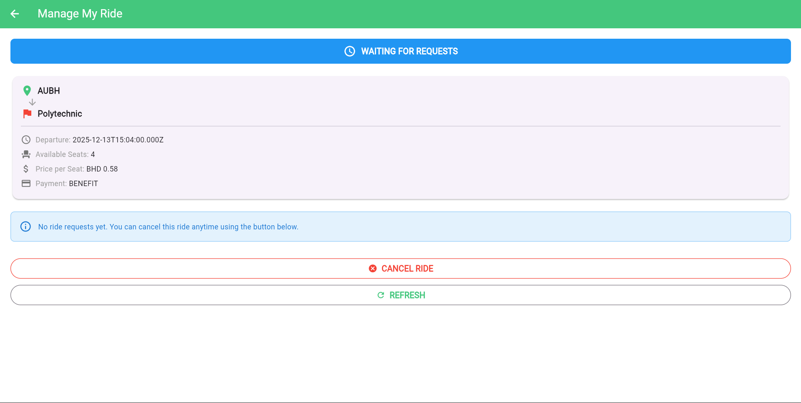
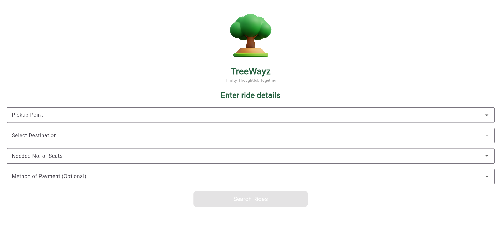
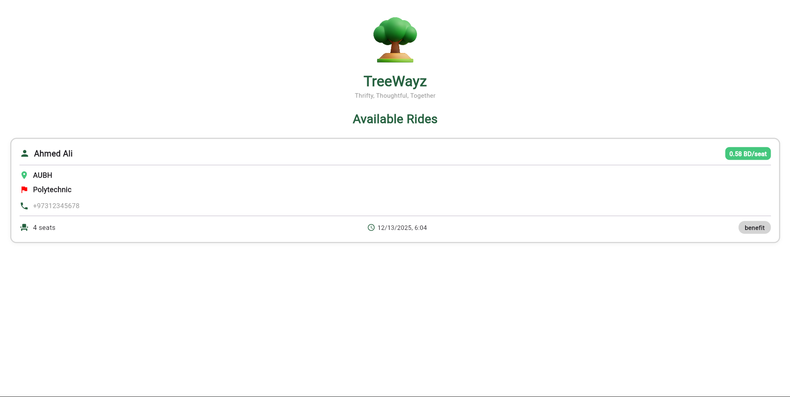

# TreeWayz - University Ridesharing Platform

TreeWayz is a ridesharing application designed specifically for AUBH (American University of Bahrain) students and staff. It addresses common transportation challenges including high costs, limited parking, and environmental impact by connecting drivers and passengers traveling similar routes to and from university.

## Table of Contents

- [Overview](#overview)
- [Features](#features)
- [Architecture](#architecture)
- [User Guide](#user-guide)
- [Prerequisites](#prerequisites)
- [Installation](#installation)
- [Configuration](#configuration)
- [Running the Project](#running-the-project)
- [API Documentation](#api-documentation)
- [Project Structure](#project-structure)
- [Troubleshooting](#troubleshooting)
- [Contributing](#contributing)

---

## Overview

TreeWayz connects university community members who share similar travel routes, enabling:
- **Drivers** to post rides and earn by sharing their journey
- **Passengers** to find affordable rides to and from campus
- **Community** to reduce transportation costs and environmental impact

### Key Highlights
- AUBH email authentication (students & staff)
- Dynamic fare calculation (0.20 BHD/km, minimum 0.50 BHD)
- Predefined campus locations (AUBH, Juffair, Busaiteen, Aali, KU, Polytechnic)
- Multiple payment methods (Cash, Benefit)
- Dual rating system (driver & rider ratings)
- Real-time ride status updates

---

## Features

### For Drivers
- Post rides with pickup/destination, time, and available seats
- View and manage pending ride requests
- Accept/reject passenger booking requests
- Start and end drives
- Rate passengers after completion
- View past rides and payment history

### For Passengers
- Search rides by location, time, and payment method
- Request rides with seat selection
- View booking status in real-time
- Rate drivers after ride completion
- Access payment receipts history

### Security & Quality
- JWT-based authentication (2-hour token expiry)
- Bcrypt password hashing (salt rounds: 10)
- SQL injection protection (parameterized queries)
- CORS-enabled API
- Transaction-based booking system

---

## Architecture

### Tech Stack

**Frontend:**
- Flutter 3.10.1+
- Dart
- HTTP package for API calls
- SharedPreferences for local storage

**Backend:**
- Node.js with Express.js
- PostgreSQL database
- JWT for authentication

**Architecture Pattern:**
- Layered architecture (Presentation → Business Logic → Data Access)
- RESTful API design
- Provider pattern for state management (Flutter)

---

## User Guide

This section provides step-by-step instructions for using TreeWayz. Follow these guides to get started with posting rides, booking rides, and rating users.

### Getting Started: Registration & Login

#### First Time Users - Registration

1. **Open the TreeWayz app** on your mobile device
   - You'll see the TreeWayz logo with the tagline "Thrifty, Thoughtful, Together"

2. **Tap "Get Started"** button
   - This takes you to the Sign In screen
   - 

3. **Tap "Not a member? Click here to sign up<3"** at the bottom
   - This link is located at the bottom of the Sign In screen

4. **Fill in your registration details:**
   - **First Name** (e.g., "Ahmed")
   - **Last Name** (e.g., "Ali")
   - **University Provided Email** (enter just your student ID like "F2300098" or staff username like "ahmed.ali")
     - The system automatically adds "@aubh.edu.bh" - don't type the @ symbol
   - **Password** (minimum 6 characters)
   - **Phone Number** (e.g., "97312345678" - numbers only, no spaces or dashes)
   - 

5. **Tap "Register"** button
   - The system will automatically add "@aubh.edu.bh" to your email
   - You'll receive a success message
   - You'll be redirected back to the Sign In screen

6. **Sign in with your new account**
   - Enter your student ID/username and password
   - Tap "Sign In" button

7. **You're now on the Home Screen!**
   - You'll see your profile card with your entered user information and ratings
   - The "Ongoing" section shows your active rides
   - Bottom navigation has: Home, Services, Receipts, Profile
   - 

#### Returning Users - Login

1. **Open the TreeWayz app** and tap "Get Started"

2. **Enter your credentials:**
   - **University Provided Email**: Your student ID or staff username (e.g., "F2300098")
   - **Password**: Your account password
   - Note: Don't include "@aubh.edu.bh" - the system adds it automatically

3. **Tap "Sign In"** button
   - You'll be taken to a loading screen briefly, then arrive at the Home Screen

---

### For Drivers: Posting a Ride

Follow these steps to post a ride and start earning money by sharing your journey:

#### Step-by-Step: Post a Ride

1. **From the Home Screen, tap the "Services" tab** in the bottom navigation

2. **Tap "Driver"** button
   - 

3. **Fill in ride details:**
   - **Pickup Location**: Choose from AUBH, Juffair, Busaiteen, Aali, KU, Polytechnic
   - **Destination**: Choose your destination (must be different from pickup)
   - **Departure Time**: Set hour, minutes, and AM/PM
   - **Available Seats**: Enter number of seats 
   - **Payment Method**: Select "Cash" or "Benefit"
   - 

4. **Review and Post**
   - The app automatically calculates fare (0.20 BHD/km, minimum 0.50 BHD per seat)
   - Tap "Post Ride" button

5. **Manage Your Ride**
   - You'll be taken to the "Driver Ride Management" screen
   - The ride also appears in "Ongoing" section on Home Screen
   - Tap "MANAGE MY RIDE" button from Home to access anytime
   - 

---

### For Passengers: Booking a Ride

Follow these steps to find and book a ride:

#### Step-by-Step: Search and Book a Ride

1. **From the Home Screen, tap the "Services" tab** in the bottom navigation

2. **Tap "Rider"** button
   - 

3. **Enter search criteria and tap "Search":**
   - **Pickup Location**: Where you want to be picked up
   - **Destination**: Where you want to go
   - **Seats Needed**: How many seats need to accomodate your needs
   - **Payment Method**: "Cash", "Benefit", or "All"
   - 

4. **Browse and select a ride**
   - View driver name, time, seats, price, payment method, and rating
   - Tap on a ride to see full details
   - 

5. **Request the ride**
   - Tap "Request Ride" button
   - Wait for driver acceptance (status shows as "Pending")
   - Check "Ongoing" section on Home Screen for updates

6. **Once accepted**
   - View driver contact info and ride details in "Ongoing" section
   - Status changes to "In Progress" when driver starts
   - You'll be prompted to rate the driver after completion

---

### For Drivers: Managing Ride Requests

1. **View Pending Requests**
   - Tap "MANAGE MY RIDE" button from Home Screen
   - 

2. **Accept/Reject Requests**
   - Review passenger name, seats requested, rating, and phone
   - Tap "Accept" or "Reject" button next to each passenger
   - Available seats automatically reduce when accepting

3. **Start and End Drive**
   - Tap "Start Drive" when departing
   - Tap "End Drive" when you reach destination

4. **Rate Passengers**
   - Tap "Rate Riders" button after ending drive
   - Rate each passenger individually (1-5 stars)

---

### Rating System

**For Passengers:**
- After ride completion, you'll see a rating prompt on Home Screen
- Select between 1-5 "leaves" (1 = Poor, 5 = Excellent)
- Tap "Submit Rating"
- You can only rate once per ride

**For Drivers:**
- After ending drive, tap "Rate Riders" button
- Select each passenger and rate 1-5 "leaves" (1 = Poor, 5 = Excellent)
- Based on punctuality, respectfulness, and cleanliness

---

### Viewing Receipts

1. **Tap the "Receipts" tab** in the bottom navigation
2. **View your ride history** with driver/passenger name, route, date, amount, and payment method
3. **Pull to refresh** to see latest rides

---

### Canceling a Ride (Drivers Only)

1. **Go to "Driver Ride Management"** screen (tap "MANAGE MY RIDE" from Home)
2. **Tap "Cancel Ride"** button at the bottom
3. **Confirm cancellation** - all pending requests are automatically rejected

**Note:** You can cancel anytime before starting the drive, even with accepted passengers.

---

### Understanding Ride Statuses

Your rides will show different statuses throughout their lifecycle:

| Status | Meaning | What You Can Do |
|--------|---------|-----------------|
| **Pending** | Ride is posted, waiting for requests | Accept/reject requests, cancel ride |
| **Booked** | At least one passenger accepted | Accept more requests, start drive, cancel ride |
| **Accepted** (In Progress) | Drive has started | End drive when destination reached |
| **Completed** | Ride finished successfully | Rate passengers/driver, view receipt |
| **Cancelled** | Ride was cancelled | View in history only |

---

## Prerequisites

Before you begin, ensure you have the following installed:

### Required Software

1. **Node.js** (v16.0.0 or higher)
   - Download from: https://nodejs.org/
   - Verify installation: `node --version`

2. **PostgreSQL** (v12.0 or higher)
   - Download from: https://www.postgresql.org/download/
   - Verify installation: `psql --version`

3. **Flutter SDK** (v3.10.1 or higher)
   - Download from: https://flutter.dev/docs/get-started/install
   - Verify installation: `flutter --version`

4. **Git**
   - Download from: https://git-scm.com/downloads
   - Verify installation: `git --version`

### Optional Tools
- **Android Studio** (for Android development)
- **Xcode** (for iOS development - macOS only)
- **VS Code** with Flutter extension
- **Postman** (for API testing)

---

## Installation

### 1. Clone the Repository

```bash
git clone https://github.com/rhedrhed/TreeWayz
cd TreeWayz
```

### 2. Backend Setup

```bash
# Navigate to backend directory
cd Backend

# Install dependencies
npm install

# Dependencies installed:
# - express: Web framework
# - pg: PostgreSQL client
# - bcryptjs: Password hashing
# - jsonwebtoken: JWT authentication
# - cors: Cross-origin resource sharing
# - dotenv: Environment variables
```

### 3. Database Setup

```bash
# Login to PostgreSQL
psql -U postgres

# Create database
CREATE DATABASE treewayz;

# Connect to database
\c treewayz

# Create tables (run the following SQL)
```

**Database Schema:**

```sql
-- Users table
CREATE TABLE Users (
    user_id SERIAL PRIMARY KEY,
    first_name VARCHAR(100) NOT NULL,
    last_name VARCHAR(100) NOT NULL,
    email VARCHAR(255) UNIQUE NOT NULL,
    password VARCHAR(255) NOT NULL,
    phone VARCHAR(20),
    rider_rating DECIMAL(2,1) DEFAULT 5.0,
    driver_rating DECIMAL(2,1) DEFAULT 5.0,
    created_at TIMESTAMP DEFAULT CURRENT_TIMESTAMP
);

-- Rides table
CREATE TABLE Rides (
    ride_id SERIAL PRIMARY KEY,
    driver_id INTEGER REFERENCES Users(user_id),
    origin VARCHAR(100) NOT NULL,
    origin_lat DECIMAL(10,8),
    origin_lng DECIMAL(11,8),
    destination VARCHAR(100) NOT NULL,
    destination_lat DECIMAL(10,8),
    destination_lng DECIMAL(11,8),
    departure_time TIMESTAMP NOT NULL,
    available_seats INTEGER NOT NULL,
    price DECIMAL(10,3) NOT NULL,
    payment_method VARCHAR(20) NOT NULL,
    status VARCHAR(20) DEFAULT 'pending',
    created_at TIMESTAMP DEFAULT CURRENT_TIMESTAMP
);

-- Bookings table
CREATE TABLE Bookings (
    booking_id SERIAL PRIMARY KEY,
    ride_id INTEGER REFERENCES Rides(ride_id),
    rider_id INTEGER REFERENCES Users(user_id),
    seats INTEGER NOT NULL,
    status VARCHAR(20) DEFAULT 'pending',
    created_at TIMESTAMP DEFAULT CURRENT_TIMESTAMP
);

-- Payments table
CREATE TABLE Payments (
    payment_id SERIAL PRIMARY KEY,
    booking_id INTEGER REFERENCES Bookings(booking_id),
    amount DECIMAL(10,3) NOT NULL,
    method VARCHAR(20) NOT NULL,
    created_at TIMESTAMP DEFAULT CURRENT_TIMESTAMP
);

-- Ratings table
CREATE TABLE Ratings (
    rating_id SERIAL PRIMARY KEY,
    ride_id INTEGER REFERENCES Rides(ride_id),
    reviewer_id INTEGER REFERENCES Users(user_id),
    reviewee_id INTEGER REFERENCES Users(user_id),
    score INTEGER CHECK (score >= 1 AND score <= 5),
    rating_type VARCHAR(20) NOT NULL,
    created_at TIMESTAMP DEFAULT CURRENT_TIMESTAMP
);
```

### 4. Frontend Setup

```bash
# Navigate to Flutter app directory
cd ../treewayz_app

# Get Flutter dependencies
flutter pub get

# Verify Flutter installation
flutter doctor
```

---

## Configuration

### Backend Configuration

Create a `.env` file in the `Backend` directory:

```bash
cd Backend
```

Create `.env` file with the following content:

```env
# Database Configuration
PGHOST=localhost
PGUSER=postgres
PGPASSWORD=your_postgres_password
PGDATABASE=treewayz
PGPORT=5432

# Server Configuration
PORT=3000

# JWT Secret (change this to a random secure string)
JWT_SECRET=your_super_secret_jwt_key_change_this_in_production
```

### Network Configuration (Important!)

If running on a physical device or different network:

```bash
# Update IP address for your network
npm run update-ip

# This script will:
# 1. Detect your local IP address
# 2. Update server.js with the correct IP
# 3. Update Flutter app configuration
```

### Frontend Configuration

Update the API base URL in your Flutter app:

**File:** `treewayz_app/lib/servicesuwu/api_service.dart`

```dart
// Update this line with your backend IP address
static const String baseUrl = 'http://YOUR_IP_ADDRESS:3000';
// Example: 'http://192.168.1.100:3000' or 'http://10.27.36.55:3000'
```

---

## Running the Project

### Step 1: Start PostgreSQL Database

Ensure PostgreSQL is running:

**Windows:**
```bash
# Check if PostgreSQL service is running
sc query postgresql-x64-14

# Start if not running
net start postgresql-x64-14
```

**macOS/Linux:**
```bash
# Check status
sudo systemctl status postgresql

# Start if not running
sudo systemctl start postgresql
```

### Step 2: Start Backend Server

```bash
# Navigate to Backend directory
cd Backend

# Start the server
node server.js

# Expected output:
#  Server running on port 3000
#  Local: http://localhost:3000
#  Network: http://YOUR_IP:3000
#  Ready for connections
```

**Test the backend database connection:**
```bash
# In a new terminal
curl http://localhost:3000/test

# Expected response:
# {"success":true,"time":"2025-12-13T..."}
```

### Step 3: Run Flutter App

**Option A: Run on Emulator/Simulator**

```bash
# Navigate to Flutter app directory
cd treewayz_app

# List available devices
flutter devices

# Run on specific device
flutter run -d <device_id>
```

**Option B: Run on Physical Device (Recommended)**

1. **Enable Developer Mode on your phone:**
   - Android: Settings → About Phone → Tap "Build Number" 7 times
   - iOS: Not applicable for this project

2. **Enable USB Debugging:**
   - Android: Settings → Developer Options → USB Debugging

3. **Connect device via USB**

4. **Run the app:**
```bash
cd treewayz_app
flutter run
```

**Option C: Run on Multiple Devices (Testing)**

```bash
# Use the provided batch script (Windows)
run-multi-device.bat

# Or manually:
flutter run -d device1 &
flutter run -d device2 &
```

### Step 4: Test the Application

1. **Register a new account:**
   - Use AUBH email format: `F2300098` or `firstname.lastname`
   - System automatically appends `@aubh.edu.bh`

2. **Login with credentials**

3. **Post a ride (as driver):**
   - Select pickup and destination
   - Set departure time
   - Specify available seats
   - Choose payment method

4. **Search for rides (as passenger):**
   - Enter search criteria
   - Request a ride
   - Wait for driver acceptance

---

## API Documentation

### Base URL
```
http://YOUR_IP:3000
```

### Authentication Endpoints

#### Register
```http
POST /register
Content-Type: application/json

{
  "first_name": "John",
  "last_name": "Doe",
  "email": "F2300098",
  "password": "securePassword123",
  "phone": "+973-12345678"
}

Response: 201 Created
{
  "success": true,
  "message": "User registered successfully.",
  "token": "eyJhbGciOiJIUzI1NiIsInR5cCI6IkpXVCJ9...",
  "user": { ... }
}
```

#### Login
```http
POST /login
Content-Type: application/json

{
  "email": "F2300098",
  "password": "securePassword123"
}

Response: 200 OK
{
  "success": true,
  "message": "Login successful.",
  "token": "eyJhbGciOiJIUzI1NiIsInR5cCI6IkpXVCJ9...",
  "user": { ... }
}
```

### Ride Endpoints (Require Authentication)

All ride endpoints require the `Authorization` header:
```
Authorization: Bearer YOUR_JWT_TOKEN
```

#### Post Ride
```http
POST /rides/postRide
Authorization: Bearer YOUR_JWT_TOKEN
Content-Type: application/json

{
  "pickup_point": "AUBH",
  "destination_point": "Juffair",
  "hour": 8,
  "minute": 30,
  "ampm": "AM",
  "available_seats": 3,
  "payment_method": "cash"
}
```

#### Search Rides
```http
GET /rides/searchRides?pickup_point=AUBH&destination_point=Juffair&seats_needed=2&payment_method=cash
Authorization: Bearer YOUR_JWT_TOKEN
```

#### Request Ride
```http
POST /rides/requestRide
Authorization: Bearer YOUR_JWT_TOKEN
Content-Type: application/json

{
  "ride_id": 1,
  "seats": 2
}
```

#### Accept Booking Request
```http
PATCH /rides/acceptRequest/:bookingId
Authorization: Bearer YOUR_JWT_TOKEN
```

#### Start Drive
```http
PATCH /rides/beginDrive/:rideId
Authorization: Bearer YOUR_JWT_TOKEN
```

#### End Drive
```http
PATCH /rides/endDrive/:rideId
Authorization: Bearer YOUR_JWT_TOKEN
```

#### Rate Driver
```http
POST /rides/rateDriver/:rideId
Authorization: Bearer YOUR_JWT_TOKEN
Content-Type: application/json

{
  "score": 5
}
```

### Receipt Endpoints

#### Get Receipts
```http
GET /api/receipts
Authorization: Bearer YOUR_JWT_TOKEN
```

---

## Project Structure

```
TreeWayz/
├── Backend/
│   ├── config/
│   │   └── pgsql.js              # Database connection pool
│   ├── data/
│   │   └── locations.js          # Predefined locations with coordinates
│   ├── middleware/
│   │   └── jwtauth.js            # JWT authentication middleware
│   ├── routes/
│   │   ├── authroutes.js         # Authentication routes
│   │   ├── homeroute.js          # Home/dashboard routes
│   │   ├── rideRoute.js          # Ride management routes
│   │   └── receiptRoute.js       # Receipt/payment routes
│   ├── .env                      # Environment variables (not in git)
│   ├── .gitignore
│   ├── package.json
│   ├── server.js                 # Main server entry point
│   └── update-ip.js              # Network configuration script
│
├── treewayz_app/
│   ├── lib/
│   │   ├── modelsuwu/            # Data models
│   │   ├── providersuwu/         # State management
│   │   ├── screensuwu/           # UI screens
│   │   ├── servicesuwu/          # API services
│   │   ├── themeuwu/             # App theming
│   │   ├── widgetsuwu/           # Reusable widgets
│   │   └── main.dart             # App entry point
│   ├── android/                  # Android configuration
│   ├── ios/                      # iOS configuration
│   ├── pubspec.yaml              # Flutter dependencies
│   └── README.md
│
├── docs/                         # Documentation files
├── README.md                     # This file
└── run-multi-device.bat         # Multi-device testing script
```

---

## Troubleshooting

### Common Issues

#### 1. Backend won't start

**Error:** `EADDRINUSE: address already in use :::5000`

**Solution:**
```bash
# Windows
netstat -ano | findstr :5000
taskkill /PID <PID> /F

# macOS/Linux
lsof -ti:5000 | xargs kill -9
```

#### 2. Database connection failed

**Error:** `connection refused` or `authentication failed`

**Solution:**
- Verify PostgreSQL is running
- Check `.env` credentials match your PostgreSQL setup
- Ensure database `treewayz` exists

```bash
# Test connection
psql -U postgres -d treewayz -c "SELECT NOW();"
```

#### 3. Flutter app can't connect to backend

**Error:** `SocketException: Failed host lookup`

**Solution:**
- Ensure backend is running
- Update IP address in Flutter app
- Check firewall settings
- Ensure phone and computer are on same network

```bash
# Find your IP address
# Windows
ipconfig

# macOS/Linux
ifconfig
```

#### 4. JWT token expired

**Error:** `403 Invalid or expired token`

**Solution:**
- Login again to get a new token
- Tokens expire after 2 hours

#### 5. Flutter dependencies error

**Error:** `Package not found` or version conflicts

**Solution:**
```bash
flutter clean
flutter pub get
flutter pub upgrade
```

#### 6. Android build fails

**Solution:**
```bash
cd android
./gradlew clean
cd ..
flutter build apk
```

---

## Testing

### Manual Testing Checklist

- [ ] User registration with AUBH email
- [ ] User login
- [ ] Driver posts a ride
- [ ] Passenger searches for rides
- [ ] Passenger requests a ride
- [ ] Driver accepts/rejects request
- [ ] Driver starts drive
- [ ] Driver ends drive
- [ ] Passenger rates driver
- [ ] Driver rates passenger
- [ ] View receipts
- [ ] Cancel ride

### API Testing with Postman

Import the following collection for quick testing:

```json
{
  "info": {
    "name": "TreeWayz API",
    "schema": "https://schema.getpostman.com/json/collection/v2.1.0/collection.json"
  },
  "item": [
    {
      "name": "Register",
      "request": {
        "method": "POST",
        "url": "http://localhost:5000/register",
        "body": {
          "mode": "raw",
          "raw": "{\"first_name\":\"Test\",\"last_name\":\"User\",\"email\":\"F2300098\",\"password\":\"test123\",\"phone\":\"+973-12345678\"}"
        }
      }
    }
  ]
}
```

---

## Contributing

Contributions are welcome! Please follow these steps:

1. Fork the repository
2. Create a feature branch (`git checkout -b feature/AmazingFeature`)
3. Commit your changes (`git commit -m 'Add some AmazingFeature'`)
4. Push to the branch (`git push origin feature/AmazingFeature`)
5. Open a Pull Request

---

## License

This project is developed as part of SWEN360/SWEN360L course at American University of Bahrain.

---

## Team

- **Project Type:** University Ridesharing Platform
- **Course:** SWEN360/SWEN360L - Software Design and Engineering/Software Design and Engineering Lab  
- **Institution:** American University of Bahrain (AUBH)

---

## Support

For issues and questions:
- Create an issue in the repository
- Contact the development team

---

## Acknowledgments

- American University of Bahrain
- Stakeholders (SWEN360/SWEN360L Course Instructors)
- TreeWayz Development Team   

---

**Happy Riding with TreeWayz!**
